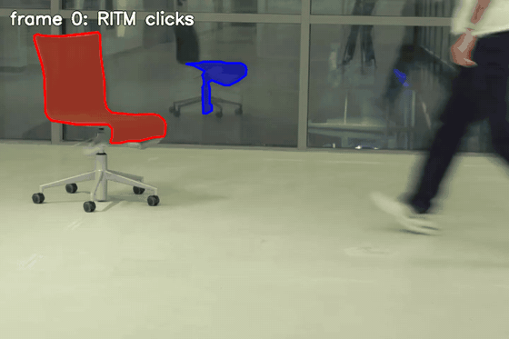
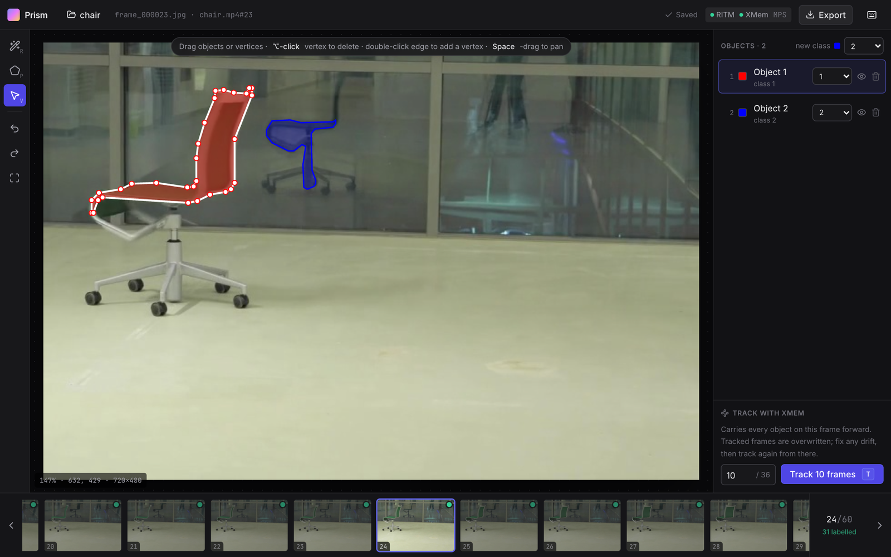
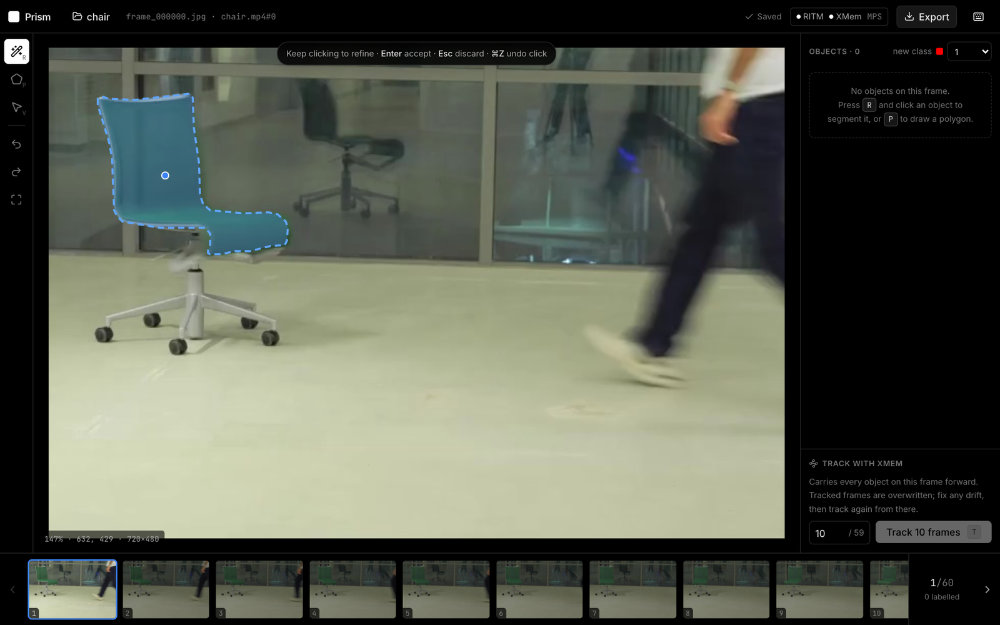
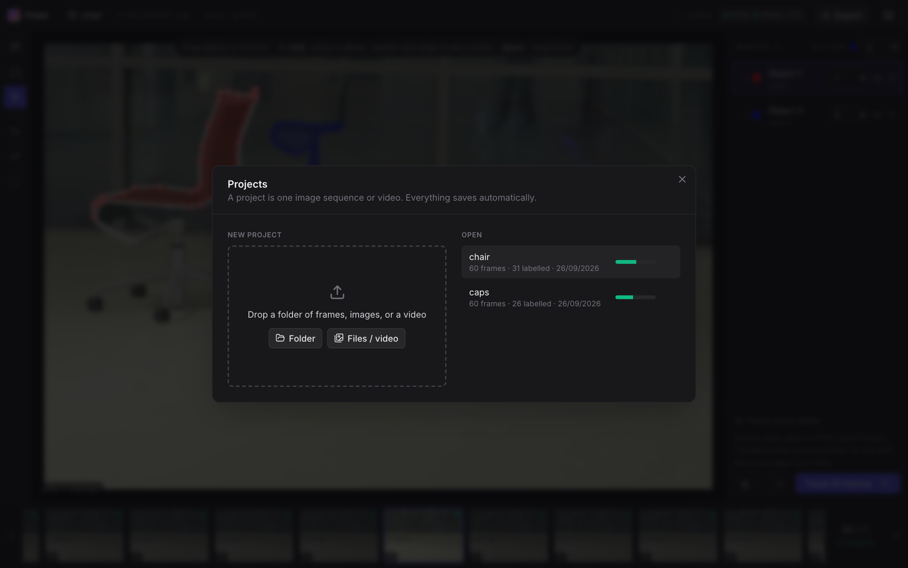
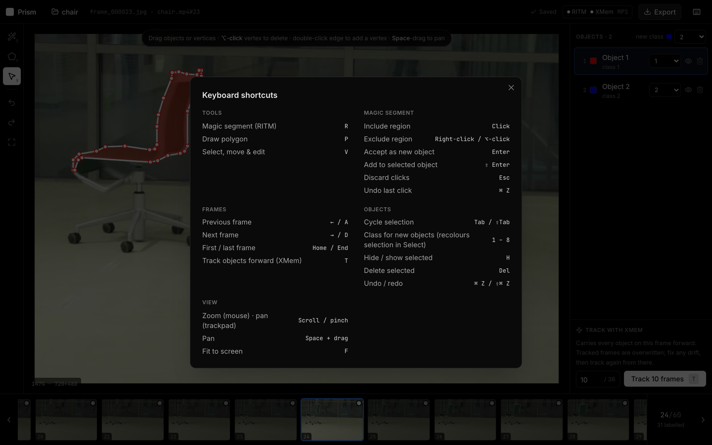

# Prism Segmenter

A web tool for interactive multi-object segmentation of images and videos. Click an object and **RITM** segments it. Press **T** and **XMem** tracks every object through the following frames. Fix any drift with polygon tools, then export polygons and masks.

Built for the **Samsung PRISM** worklet *"A software tool to generate Multi-view Image Segmentation & Correction"*.

<p align="center">
  
</p>



## Features

- **One-click segmentation (RITM):** click to include, right-click to exclude, Enter to accept.
- **Video object tracking (XMem):** carry every object on the current frame through the next *N* frames (you choose *N*). Each object keeps its own ID, name and class.
- **Corrections that stick:** frames you draw or edit become *keyframes*. Tracking learns from keyframes at or before the current frame, and never overwrites them. You can let it pick references automatically or choose them yourself.
- **Polygon tools:** draw polygons, drag vertices or whole objects, double-click an edge to add a vertex, ⌥-click to remove one. Multi-part objects are supported.
- **Keyboard-first:** frames, tools, classes and tracking are all on single keys. Press `?` in the app for the full list.
- **Autosave with undo/redo:** everything is written to disk as you work, and reloading the page returns you to the same frame.
- **Upload anything:** drop a folder of frames, a set of images, or a video file.
- **Export:** a zip of polygon JSON plus class-colour PNG masks per frame.
- **Runs on NVIDIA GPUs, Apple Silicon (MPS) or CPU**, picked automatically.

| Click to segment | Projects | Shortcuts |
|---|---|---|
|  |  |  |

## Quick start

Requirements: Python 3.10–3.12 (or [uv](https://docs.astral.sh/uv/)), Node 18+, and about 300 MB for model weights.

```bash
git clone https://github.com/Prasannakbhat123/Samsung-Prism.git
cd Samsung-Prism
scripts/setup.sh              # .venv + requirements + weights + web build
.venv/bin/python -m server    # then open http://127.0.0.1:8000
```

`setup.sh` is safe to re-run. It skips the weights you already have and verifies checksums.

### Model weights

`scripts/setup.sh` downloads both checkpoints (run `scripts/download_weights.sh` to fetch only these). To download them by hand, save them at these paths:

| Model | Download | Size | Save as |
|---|---|---|---|
| RITM HRNet-18 IT-M (COCO+LVIS) | [coco_lvis_h18_itermask.pth](https://github.com/hkchengrex/Cutie/releases/download/v1.0/coco_lvis_h18_itermask.pth) | 41 MB | `ritm_interactive_segmentation/weights/hrnet18_cocolvis_itermask_3p.pth` |
| XMem | [XMem.pth](https://github.com/hkchengrex/XMem/releases/download/v1.0/XMem.pth) | 249 MB | `XMem2-cpu-web/saves/XMem.pth` |

The original RITM release links no longer resolve. The file above is the identical checkpoint (SHA-256 `5f69cfce…ee32b`), re-hosted in the release of the XMem author's Cutie project. The SHA-256 checksums are in `scripts/download_weights.sh`.

**NVIDIA GPUs:** if the default `pip install torch` doesn't match your CUDA version, install PyTorch from [pytorch.org](https://pytorch.org/get-started/locally/) into `.venv` first, then run `scripts/setup.sh`.

### Developing

```bash
npm install     # root: installs `concurrently`
npm run dev     # Python API on :8000 + Vite with hot reload on :5173
```

## How to use it

1. **Create a project.** Drop a folder of frames or a video onto the Projects dialog. Frames are ordered by filename (natural sort) and renamed `frame_000000.jpg`, `frame_000001.jpg`, and so on. Original names are kept in `project.json`.
2. **Segment the first frame.** In Magic mode (`R`), click an object. Add more clicks to refine it (right-click or ⌥-click marks background), then press **Enter**. Press `1`–`8` beforehand to choose the class of the next object.
3. **Track.** Pick how many frames to carry forward (1 / 5 / 10 / 25 / All, or type a number), then press **T**. XMem fills those frames and you land on the next one to review.
4. **Correct and continue.** Where tracking drifts, fix the object with RITM clicks (⇧Enter adds to the selected object) or the Select tool (`V`), then track again from that frame. Any frame you edit becomes a keyframe, marked with a filled dot in the frame strip; tracked frames get a hollow ring.
5. **Export** from the top bar.

### How tracking uses your frames

Tracking from frame *N* only looks backwards. It never uses frames after the one it's predicting.

- **What it learns from:** frame *N*, plus reference frames before it:
  - **Auto (default):** the 10 nearest keyframes before *N*.
  - **Chosen:** press `K` on a frame, or ⇧-click its thumbnail, to mark it as a reference (a blue `REF` tag). Only chosen frames before *N* are used, up to 30. *Clear* in the track panel switches back to auto.
- **What it writes:** the next *N* frames you asked for. Keyframes in that range are kept exactly as you left them and used as new references for the frames after them. So fixing frame 30 and re-tracking from frame 20 improves 31 onwards and leaves 30 alone.
- **Carried objects:** only objects on frame *N* are tracked. Renaming or reclassifying an object on a keyframe carries forward from there.

| Key | Action | Key | Action |
|---|---|---|---|
| `R` `P` `V` | Magic / Polygon / Select | `←` `→` or `A` `D` | Previous / next frame |
| Click, right-click | RITM include / exclude | `T` | Track forward with XMem |
| `Enter` / `⇧Enter` | Accept as new / add to selected | `1`–`8` | Class for new objects |
| `Esc` | Discard clicks / deselect | `Tab` | Cycle objects |
| `K` / ⇧-click thumbnail | Choose reference frame | `Home` / `End` | First / last frame |
| `⌘Z` / `⇧⌘Z` | Undo / redo | `Del` / `H` | Delete / hide selected |
| Scroll / `Space`+drag | Zoom / pan | `F` | Fit to screen |

## Data

Projects live in `data/<project>/` (set `PRISM_DATA_DIR` to put them elsewhere):

```
data/my-video/
├── project.json                     frame list + original filenames
├── frames/frame_000000.jpg
├── annotations/frame_000000.json    polygons (source of truth)
└── masks/frame_000000.png           class-colour masks, regenerated on save
```

Annotation files use the same schema as the original tool, so earlier exports still load:

```json
{
  "imageName": "frame_000000.jpg",
  "source": "manual",
  "classes": [
    { "className": "1",
      "instances": [ { "instanceId": "Object-1", "name": "Chair", "coordinates": [[x, y], ...] } ] }
  ]
}
```

`source` is `"manual"` for keyframes (drawn or edited by a person) and `"xmem"` for tracking output. Files without it, such as those from the original tool, count as manual. An object made of several polygons is stored as several instances that share one `instanceId`. Mask colours (BGR) are the original mapping: `1` red, `2` blue, `3` green, `4` cyan, `5` magenta, `6` yellow, `7` purple, `8` orange.

To import data from the old `JPEGImages/` + `json/` layout:

```bash
.venv/bin/python -m server import my-project path/to/JPEGImages path/to/json
```

## Configuration

| Variable | Default | |
|---|---|---|
| `PRISM_DEVICE` | auto | `cuda`, `cuda:1`, `mps` or `cpu`. Auto picks CUDA → MPS → CPU. |
| `PRISM_DATA_DIR` | `./data` | Where projects are stored |
| `PRISM_PORT` / `PRISM_HOST` | `8000` / `127.0.0.1` | Server address |
| `PRISM_RITM_WEIGHTS` | `ritm_interactive_segmentation/weights/hrnet18_cocolvis_itermask_3p.pth` | |
| `PRISM_XMEM_WEIGHTS` | `XMem2-cpu-web/saves/XMem.pth` | |

## Architecture

```
web/  (React + Vite + Tailwind)  ──/api──▶  server/  (Flask, one process)
                                              ├── store.py   projects, frames, annotations, masks
                                              ├── models.py  RITM + XMem, loaded once, kept in memory
                                              └── app.py     HTTP API, serves web/dist
ritm_interactive_segmentation/   RITM model code (isegm)
XMem2-cpu-web/                   XMem / XMem++ model code
```

<details>
<summary>HTTP API</summary>

| Method | Path | |
|---|---|---|
| GET | `/api/status` | device and model load state |
| GET / POST | `/api/projects` | list / create (multipart `name`, `files[]`) |
| GET / DELETE | `/api/projects/<p>` | frames with `annotated` / `keyframe` flags / delete |
| GET | `/api/projects/<p>/export` | zip of annotations + masks |
| GET | `/api/projects/<p>/frames/<f>/image` | frame image |
| GET / PUT | `/api/projects/<p>/frames/<f>/annotation` | `{objects: [{id, name, className, polygons}], source}`; PUT makes a keyframe |
| POST | `/api/projects/<p>/frames/<f>/ritm/click` | `{x, y, positive}` → `{polygons, clicks}` |
| POST | `/api/projects/<p>/frames/<f>/ritm/undo` | undo last click |
| POST | `/api/ritm/reset` | discard the current RITM object |
| POST | `/api/projects/<p>/frames/<f>/propagate` | `{count, references?}` → `{frames, kept, references}`: track with XMem |

</details>

**Version 2 changes:** the original Express server, the separate RITM Flask app and the per-frame Python subprocesses are replaced by one Python server. It no longer needs two conflicting virtualenvs or hard-coded paths, and it doesn't collide with macOS AirPlay on port 5000. XMem now runs in-process with one label per object, instead of round-tripping through colour masks and bounding-box matching. It is about 10× faster per frame, and same-class objects no longer merge. The old `frontend/`, `backend/` and the RITM/XMem desktop GUIs have been removed.

## Team

Samsung PRISM worklet, Department of Computer Science and Engineering.

- **A S Aravinthakshan** · [@aravinthakshan](https://github.com/aravinthakshan)
- **Kavya Bansal**
- **Prasanna** · [@Prasannakbhat123](https://github.com/Prasannakbhat123)
- **Janak Shah**

- Faculty guide: **Prof. Prakash Aithal**
- Samsung point of contact: **Shouvik Das**

Project reports, the end-review deck and the original demo video are in [`Documentation/`](Documentation).

## Acknowledgements

- **RITM:** K. Sofiiuk, I. Petrov, A. Konushin, [*Reviving Iterative Training with Mask Guidance for Interactive Segmentation*](https://arxiv.org/abs/2102.06583), 2021. Code and weights © Samsung Electronics, MIT License.
- **XMem:** H. K. Cheng, A. G. Schwing, [*XMem: Long-Term Video Object Segmentation with an Atkinson-Shiffrin Memory Model*](https://arxiv.org/abs/2207.07115), ECCV 2022.
- **XMem++:** M. Bekuzarov, A. Bermudez, J.-Y. Lee, H. Li, [*XMem++: Production-level Video Segmentation From Few Annotated Frames*](https://arxiv.org/abs/2307.15958), ICCV 2023. The `XMem2-cpu-web/` code is GPL-3.0.
- The screenshots use the `chair` example clip from XMem++'s PUMaVOS dataset (CC BY 4.0).
- The RITM checkpoint is downloaded from the [Cutie](https://github.com/hkchengrex/Cutie) release, because the original RITM release links no longer resolve.
